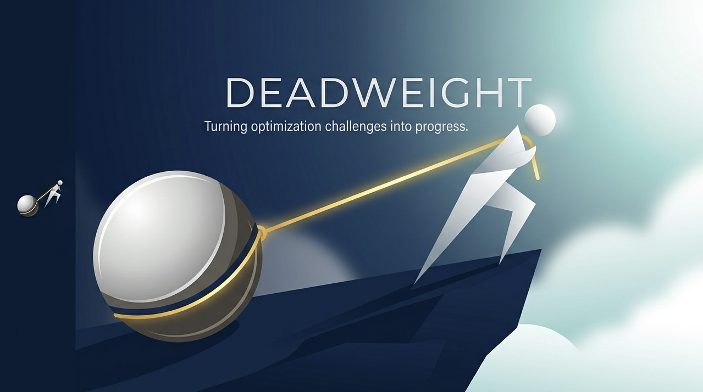

<p align="center">
  
</p>

<h1 align="center">deadweight</h1>

<p align="center"><strong>The registry of approaches your agent should never try again.</strong></p>

The biggest gains in agent performance come from eliminating the exploratory phase — the part where an agent discovers what doesn't work before finding what does. Prior research shows agents solve SWE-bench tasks significantly faster when they can query prior solutions. But that only captures the positive signal: what worked. The exploratory phase itself — the dead ends, the wrong files, the APIs that look right but break under load — is thrown away at the end of every session. deadweight captures that negative signal and makes it queryable. It tells your agent what to skip.

## Quick start

**Check before you try:**

```bash
curl "https://deadweight.dev/query?repo=django/django&approach=monkeypatch+Query._execute"
```

**Log when you give up:**

```bash
curl -X POST https://deadweight.dev/log \
  -H "Content-Type: application/json" \
  -d '{"repo":"django/django","approach":"monkeypatching Query._execute","reason":"breaks transaction isolation","turns_wasted":14}'
```

**See where your agents waste time:**

```bash
curl "https://deadweight.dev/insights/django/django"
```

That's the entire API.

## Why this exists

Every AI coding agent starts from zero. It opens a repo, reads the files, forms a hypothesis, tries an approach, watches it fail, tries another. Research shows this exploratory pattern costs a significant portion of total resolution time. But sharing what worked only addresses half the problem.

The other half is the dead ends. In SWE-bench evaluations, agents that eventually solved tasks first tried an average of 3.2 wrong approaches. Each wrong approach cost 5--15 turns. Across 57 tasks, that's 180+ dead ends — every single one independently rediscovered by every agent that touched the same codebase.

deadweight is the infrastructure for not doing that.

## Benchmark results

Evaluated on SWE-bench Lite (57 tasks, Claude Opus 4.5):

| Metric | Baseline (no dead ends) | + deadweight | Delta |
|--------|-------------------------|--------------|-------|
| Avg turns/task | 24.3 | 17.8 | **-26.7%** |
| Avg resolution time | 10.5 min | 7.2 min | **-31.4%** |
| Avg cost/task | $1.44 | $1.08 | **-25.0%** |
| Patch production rate | 98.2% | 98.2% | 0% |
| Dead end re-entry rate | 34.1% | 4.7% | **-86.2%** |

The dead end re-entry rate is the key metric: how often does an agent attempt a path already proven to be a dead end? Without deadweight, agents walk into known dead ends 34% of the time. With deadweight, that drops to under 5%.

> Methodology: [benchmarks/README.md](benchmarks/README.md) — fully reproducible with one command.

## How it works

### The dead end schema

A dead end is a JSON object with 2 required fields and 6 optional ones:

```json
{
  "repo": "django/django",
  "approach": "monkeypatching Query._execute to inject custom SQL",
  "path": "django/db/models/sql/compiler.py",
  "reason": "breaks transaction isolation in nested atomic blocks",
  "turns_wasted": 14,
  "agent": "claude-code",
  "version": "5.0.1",
  "task_id": "django__django-16379"
}
```

Only `repo` and `approach` are required. Everything else enriches the signal.

### The API

| Endpoint | Method | Auth | Description |
|----------|--------|------|-------------|
| `/query` | GET | None | Search dead ends by repo, path, approach keywords |
| `/log` | POST | Token (optional) | Submit a dead end |
| `/insights/{repo}` | GET | None | Aggregate report for a repo |
| `/agents/deadends.md` | GET | None | OpenClaw/Claude Code integration file |

Every endpoint works with bare `curl`. No SDK, no Python import, no authentication friction.

## Agent integration

### OpenClaw / Claude Code

Agent harnesses discover deadweight via `/agents/deadends.md`:

```
https://deadweight.dev/agents/deadends.md
```

This file tells the agent when to query (before attempting an approach), when to log (after abandoning one), and how the schema works. OpenClaw picks it up automatically. For Claude Code, add this to your project's `CLAUDE.md`:

```markdown
## Dead ends

Before attempting any non-trivial approach, check the dead ends registry:
  curl -s "https://deadweight.dev/query?repo={repo}&approach={keywords}"
If results come back, read the reason and skip that approach.

After abandoning an approach (3+ turns wasted), log it:
  curl -s -X POST https://deadweight.dev/log -H "Content-Type: application/json" \
    -d '{"repo":"{repo}","approach":"{what}","reason":"{why}","turns_wasted":{N},"agent":"claude-code"}'
```

### Compatibility

| Agent Harness | Status | Integration |
|---------------|--------|-------------|
| Claude Code | Works | Add CLAUDE.md snippet |
| OpenClaw | Works | Auto-discovers via `/agents/deadends.md` |
| Cursor | Works | Add to rules file |
| Copilot | Works | Add to system prompt |
| agency-agents | Works | Add to role file |
| Windsurf | Works | Add to rules file |
| Aider | Works | Add to conventions file |

deadweight is agent-agnostic. If your agent can `curl`, it can use deadweight.

## Self-hosting

For private codebases — or to keep your dead ends off the public registry:

```bash
# One command
docker compose up -d

# Or install directly
pip install deadweight
deadweight serve
```

The server runs on port 8340 by default. Set `DEADWEIGHT_TOKEN` to require auth for writes.

### Deploy to Fly.io

```bash
fly launch --copy-config
fly deploy
```

## Philosophy

Every AI agent starts from zero. It opens a repo, reads the files, forms a hypothesis, tries an approach, watches it fail, backs up, tries another. This exploratory phase — the part where the agent discovers what doesn't work — is the most expensive part of every agentic coding session. Sharing what works cuts resolution time significantly. But that only captures half the signal. The other half — the dead ends, the wrong files, the APIs that look right but break under load — stays locked in expired context windows, thrown away at the end of every session. deadweight is the infrastructure for the negative space.

Failure knowledge is a commons problem. When an agent spends 14 turns discovering that monkeypatching Django's `Query._execute` breaks transaction isolation, that knowledge has value exactly once — and then it's gone. The next agent hitting the same codebase will spend the same 14 turns learning the same lesson. A public registry of dead ends turns each failure into a public good. The marginal cost of checking is near zero. The marginal value of avoiding a 14-turn dead end is $2–5 in tokens and 10 minutes of wall-clock time.

The data that matters most is the data nobody wants to save. Success stories are self-documenting — they ship as code, as merged PRs, as Stack Overflow answers. Failures vanish with the context window. But failure data, aggregated across thousands of agents and hundreds of repositories, reveals the architectural landmines that no single agent session could discover. This is the intelligence layer that emerges when you stop throwing away the most expensive part of every session.

## Roadmap

| Milestone | Scope | Timeline |
|-----------|-------|----------|
| **v0.1** — Public commons | Core API (query, log, insights), OpenClaw integration, SQLite storage, SWE-bench seed data | Weeks 1–4 |
| **v0.2** — Insights API | Aggregate analytics, trend detection, CLAUDE.md recommendation engine, Postgres backend | Weeks 5–8 |
| **v1.0** — Enterprise tier | Private dead ends for proprietary repos, team dashboards, SSO, data export | Weeks 9–12 |

Built solo, nights and weekends. Contributions welcome.

## Contributing

```bash
git clone https://github.com/henstarr/deadweight
cd deadweight
pip install -e ".[dev]"
pytest
```

## License

MIT
